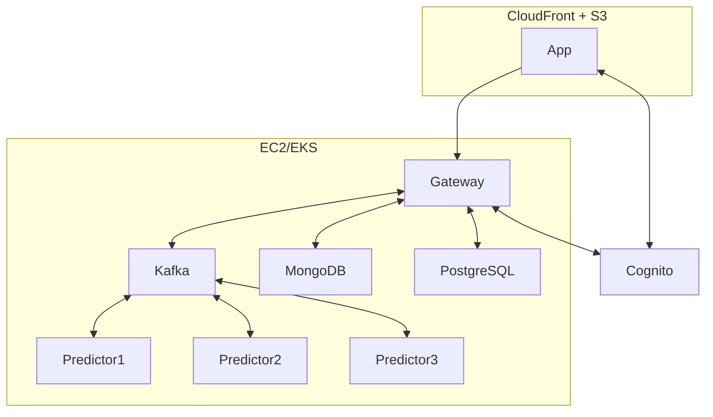

# ml-sc

A simple machine learning system consisting of multiple components:
* Frontend App [TypeScript + Angular]
* Gateway [Java + Spring Boot]
* Setup Storage [PostgreSQL]
* Prediction Storage [MongoDB]
* Message Broker [Kafka]
* 3 Predictors [Python + scikit-learn]

#### Source code on GitLab
https://gitlab.com/ml-sc

#### Infrastructure diagram

